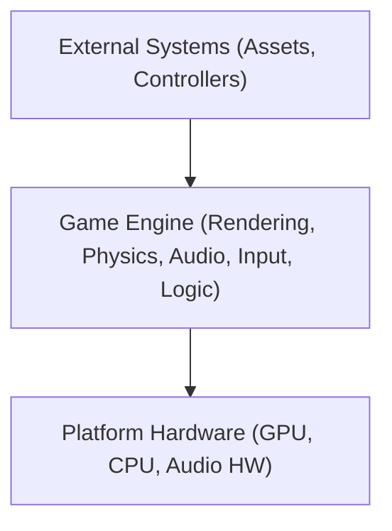

# Technical Design Document (TDD) for C++ Game Engine

## Document Header
- **Project Title:** C++ Game Engine Project
- **Version:** 1.0
- **Date:** 2025-02-09
- **Author(s):** [MAGNIER Hugo, RIVIALE Antoine, PIRES Ruben, MAGEAU Antoine, VAN LAECKE Tristan, MOHAMED Axami, GUILLEMART Léo]
- **Contact:** [hmagnier@gaming.tech, ariviale@gaming.tech, amageau@gaming.tech, tvanlaecke@gaming.tech, amohamed@gaming.tech, lguillemart@gaming.tech]

## Revision History
| Date       | Version | Description                | Author      |
|------------|---------|----------------------------|-------------|
| 2025-02-09 | 1.0     | Initial document creation  | [All] |

## Table of Contents
1. [Introduction](#1-introduction)
2. [System Overview](#2-system-overview)
3. [Requirements](#3-requirements)
4. [System Architecture & Design](#4-system-architecture--design)
5. [Detailed Module Design](#5-detailed-module-design)
6. [Interface Design](#6-interface-design)
7. [Performance and Optimization](#7-performance-and-optimization)
8. [Testing Strategy (TDD Implementation)](#8-testing-strategy-tdd-implementation)
9. [Tools, Environment, and Deployment](#9-tools-environment-and-deployment)
10. [Security and Safety Considerations](#10-security-and-safety-considerations)
11. [Project Timeline and Milestones](#11-project-timeline-and-milestones)
12. [Appendices](#12-appendices)

---

## 1. Introduction

### 1.1 Purpose
This document outlines the technical design for a modular C++ Game Engine, detailing its architecture, modules, and Test-Driven Development (TDD) approach.

### 1.2 Scope
- **Objective:** Develop a game engine for rendering, physics, audio, and input management.
- **Application:** Real-time game development and academic projects.

### 1.3 Definitions, Acronyms, and Abbreviations
- **TDD:** Test-Driven Development  
- **API:** Application Programming Interface  
- **FPS:** Frames Per Second  
- **IDE:** Integrated Development Environment

### 1.4 References
- [C++ Standard Documentation](https://isocpp.org)
- [Google Test Framework](https://github.com/google/googletest)

### 1.5 Document Overview
This TDD details the design, module interactions, and testing strategies for the game engine, ensuring clarity from high-level architecture to low-level implementation details.

### 1.6 Code Conventions
- File Names: PacalCase
- Type Names: PascalCase
- Method Names: PascalCase
- Member Variable Names: camelCase
- Constant Names: UPPER_SNAKE_CASE
- Closures: {\
  }

---

## 2. System Overview

### 2.1 High-Level Description
The engine is a modular system written in C++ (C++20), designed to manage rendering, physics simulation, audio processing, and input handling in real-time.

### 2.2 System Context Diagram



### 2.3 Major Components
- **Rendering Engine:** Handles graphics using the Directx11 API.
- **Physics Engine:** Manages collision detection and physics simulations using the JoltPhysics API.
- **Audio Engine:** Processes sound effects and music using the Miniaudio API.
- **Input Manager:** Captures keyboard, mouse, and gamepad events using the GLFW API.
- **Game Logic:** Integrates modules via a scripting interface.

---

## 3. Requirements

### 3.1 Functional Requirements
- Render 2D/3D graphics with dynamic lighting and shading.
- Perform real-time physics simulation and collision detection.
- Play background music and trigger sound effects.
- Capture and process user inputs.
- Provide a scripting interface for game behavior customization.

### 3.2 Non-Functional Requirements
- **Performance:** Maintain a minimum of 60 FPS.
- **Scalability:** Modular design for easy extension.
- **Portability:** Support Windows
- **Maintainability:** Clear code structure with thorough documentation.

### 3.3 Use Cases
- **Rendering:** Load and display complex scenes.
- **Physics:** Update object states and detect collisions.
- **Audio:** Manage and play audio assets.
- **Input:** Map user actions to game events.

### 3.4 Design Constraints and Assumptions
- Use modern C++ (C++20).
- Rely on hardware-accelerated graphics.
- Assume a minimum hardware configuration for target platforms.

---

## 4. System Architecture & Design

### 4.1 Architectural Overview
The engine employs a component-based architecture. Each module has well-defined interfaces, ensuring loose coupling and isolated development.

### 4.2 Module Breakdown
- **Rendering Module:** Handles shaders, textures, and communicates with the GPU.
- **Physics Module:** Implements collision detection and rigid body dynamics.
- **Audio Module:** Interfaces with audio libraries (e.g., OpenAL).
- **Input Module:** Abstracts device-specific input.
- **Game Logic Module:** Manages scripting and event coordination.

### 4.3 Interaction Diagrams

#### Sequence Diagram: Rendering a Frame
```

User Input -> Game Logic -> Rendering Module -> GPU

```

#### Game Engine Flowchart


### 4.4 Design Decisions and Rationale
- **Language Choice:** C++ for high performance.
- **Modular Design:** Supports isolated testing and independent module development.
- **TDD:** Ensures high code quality and early bug detection.

---

## 5. Detailed Module Design

### 5.1 Class Diagrams and Data Structures
- **Rendering:** `Renderer`, `Shader`, `Texture`
- **Physics:** `PhysicsEngine`, `Collider`, `RigidBody`
- **Audio:** `AudioEngine`, `Sound`, `MusicPlayer`
- **Input:** `InputManager`, `Controller`

### 5.2 Error Handling and Logging

- Utilize exception handling for critical errors.
- Implement a logging system to record runtime events and performance metrics.

---

## 6. Interface Design

### 6.1 Internal Interfaces

- Define clear APIs between modules using abstract classes or interfaces.

### 6.2 External APIs and File Formats

- Graphics API: Directx11
- Physics API: JoltPhysics
- Audio API: Miniaudio
- Window API: GLFW
- Maths API: GLM
- GUI API: ImGui

- Support standard file formats: OBJ (models), PNG (textures), WAV (audio).
- Provide documentation for external scripting interfaces.

### 6.3 User Interface (if applicable)

- Develop a debug UI for real-time performance monitoring and diagnostics.

---

## 7. Performance and Optimization

### 7.1 Performance Goals

- Consistently achieve 60 FPS.
- Optimize memory usage and processing overhead.

### 7.2 Profiling and Benchmarking

- Integrate profiling tools such as Valgrind or Visual Studio Profiler.
- Include benchmarking tests as part of the TDD suite.

### 7.3 Optimization Techniques

- Use object pooling and memory management best practices.
- Implement batching and frustum culling in the rendering process.

---

## 8. Testing Strategy (TDD Implementation)

### 8.1 Overview of TDD

- Write tests before implementation to drive design decisions and ensure code reliability.

### 8.2 Unit Testing

- Develop tests for individual components.
- **Example using Google Test:**

```cpp
#include <gtest/gtest.h>
#include "Renderer.h"

TEST(RendererTest, InitializeSuccess) {
    Renderer renderer;
    EXPECT_TRUE(renderer.initialize());
}
```

### 8.3 Integration Testing

- Verify that modules interact correctly through integration tests.

### 8.4 Regression Testing

- Maintain a suite of automated tests to catch and fix regressions early.

### 8.5 Testing Tools and Frameworks

- **Framework:** Google Test

---

## 9. Tools, Environment, and Deployment

### 9.1 Development Tools and IDEs

- Recommended IDEs: Visual Studio, CLion, or VSCode.
- Code editors that support C++20 features.

### 9.2 Version Control

- Use Git for version control.
- Adopt a clear branching strategy for feature development.

### 9.3 Deployment Environment

- Target platforms: Windows
- Provide deployment instructions and environment setup guides.

---

## 10. Security and Safety Considerations

- Implement robust error handling.
- Perform regular code reviews.

---

## 11. Project Timeline and Milestones

- **Phase 1:** Requirement Analysis & Detailed Design
- **Phase 2:** Core Module Development (Rendering, Physics, Audio, Input)
- **Phase 3:** Integration and Testing
- **Phase 4:** Optimization and Final Deployment
- Outline milestones with deadlines and deliverables.

---

## 12. Appendices

### 12.1 Glossary

- **Game Engine:** The core framework managing all game processes.
- **Module:** A self-contained component providing specific functionality.
- **Shader:** A program executed on the GPU to control rendering.
